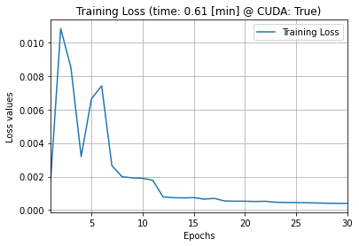

# **서울과학술대학교 오픈소스프로그래밍**

## **프로젝트 개요**
LSTM(Long Short-Term Memory)를 이용하여 이더리움의 시간별 OHLCV(시가,최고가,최저가,종가,매매량)을 바탕으로 회귀분석(regression)을 통하여 이더리움의 가격을 예측하는 프로젝트.
  
## **요구 패키지**
* ccxt
* torch
* matplotlib
* sklearn
* numpy

## 들어가기 앞서
이 프로젝트는 서울과기대 컴퓨터공학부 오픈소스-프로그래밍 기간 프로젝트 제출용으로 만들어졌습니다. 학부생 수준으로 작성되었으며, 대부분의 코드는 수업시간 강의자료에 기반하였습니다.
때문에 정확성이 매우 떨어지며, 혹여나 이를 실제 코인 투자에 활용할 시 참고만 하시기 바랍니다.

# 사용법
ETH_LSTM.py 를 실행시 코인 거래소인 바이낸스에서 자동으로 이더리움의 OHLCV 데이터를 가져와서 데이터셋을 업데이트합니다. 그 후 데이터셋에서 필요한 데이터를 추출하여
LSTM 기반 딥러닝을 진행한 후, 이더리움의 다음날 가격을 예측합니다.

이때 ETH_LSTM.py의 t_frame를 적절히 변경하면 다음날이 아닌 12시간 뒤, 1시간 뒤 가격을 예측할 수 있습니다.
또한 LSTM의 layer나 epoch 수를 조정할 수도 있습니다. 관련 변수들은 후술하겠습니다.

# 파일별 설명
## binance_data_load.py
binance API를 이용하여 이더리움의 OHLCV 데이터를 가져와 csv파일로 저장하거나, 데이터를 가져오는 클래스인 binance_data 가 존재하는 .py파일입니다.

## ETH_LSTM.py
LSTM를 이용하여 딥러닝을 하는 .py파일입니다.

* binance 관련 변수
```python
# 바이낸스의 API 키 입력(없을시 '', 대신 최신 데이터 사용불가)
api_key = ''

# 바이낸스의 시크릿 키 입력(없을시 '', 대신 최신 데이터 사용불가)
secret = ''

# OHLCV의 시간 간격 (ex. '15m' -> 10시 15분 데이터, 10시 30분 데이터...)
t_frame = '1d' # '1m','15m','30m','1h','3h','1d'

# 가져올 코인 '코인/단위 임. 
symbol = 'ETH/USDT'
```
* LSTM 관련 변수
LSTM 관련 변수들로 적절히 변경 가능
```python
EPOCH_MAX = 50 # epoch 횟수
EPOCH_LOG = 1 # epoch 횟수별 표시 간격
OPTIMIZER_PARAM = {'lr': 0.01} # learning rate
SCHEDULER_PARAM = {'step_size': 5, 'gamma': 0.5} # scheduler param
USE_CUDA = torch.cuda.is_available() # CUDA 사용유무
SAVE_MODEL = f'./data/ETH_LSTM._{t_frame}pt' # Make empty('') if you don't want save the model
RANDOM_SEED = 777 # 랜덤시드 고정
DATA_LOADER_PARAM = {'batch_size': 50, 'shuffle': False} # data loader param
```

## 내용 설명

## 결론
t_frame = '1d' (즉, 하루를 기준으로)
  



## 참고자료

### binance_data_load.py 관련
* [파이썬을 이용한 비트코인 자동매매 (개정판)](https://wikidocs.net/120385)
### ## ETH_LSTM.py 관련
* 오픈소스프로그래밍 강의자료 (DL.pdf) [관련 Github](https://github.com/mint-lab/dl_tutorial)
* [위대한 개스피 채널](https://www.youtube.com/watch?v=9haME49Rx_0)[관련 Colab](https://colab.research.google.com/drive/149QFMKdMu9iSQoD6MaQ7ON5sncHzdH3x?usp=sharing#scrollTo=asdN_HvQfTpw)

